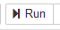

# open-electives 

A way to see what electives are still open

Click on the binder badge above, select the first cell, then select the "Run" button ()

Before hitting "run", the screen will show what was available at the time of writing.

